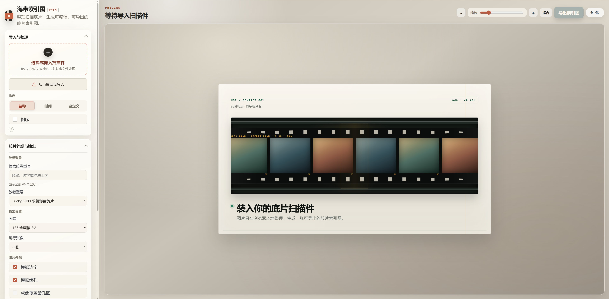
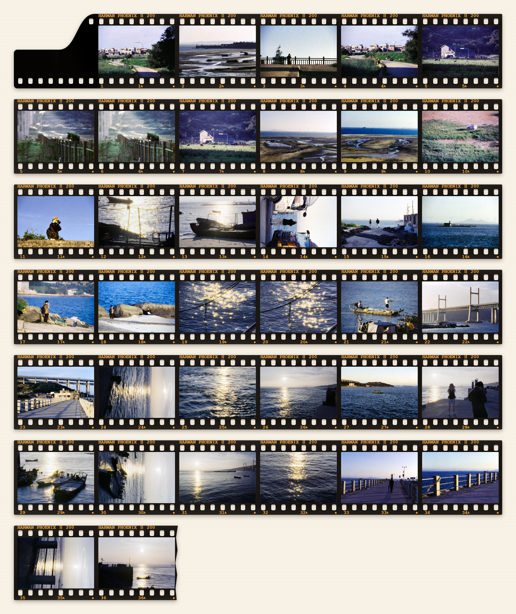
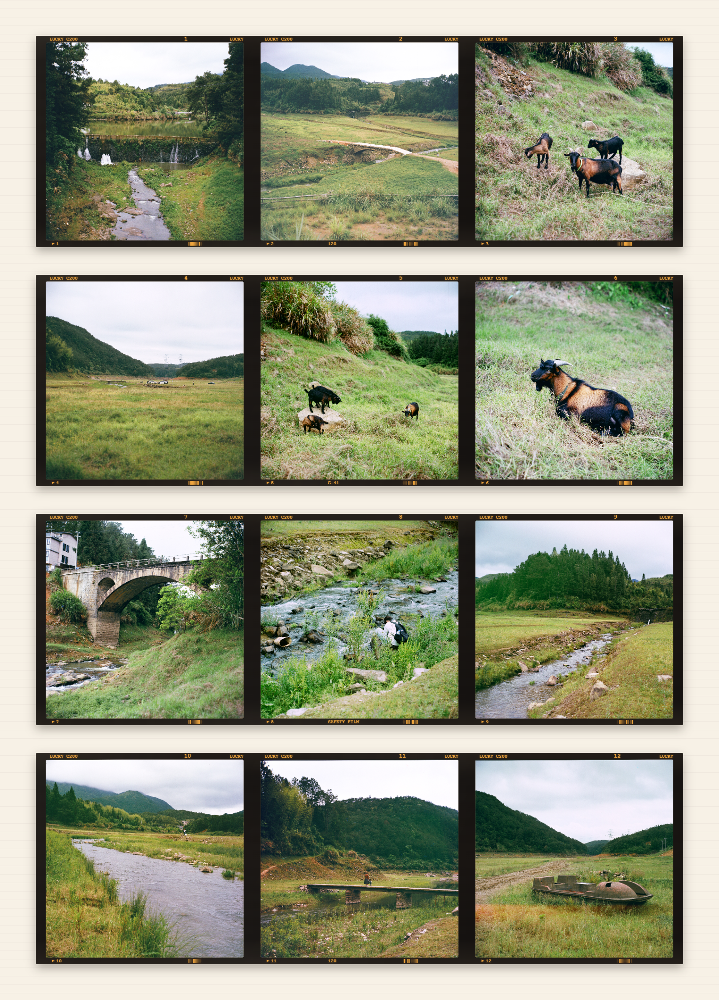
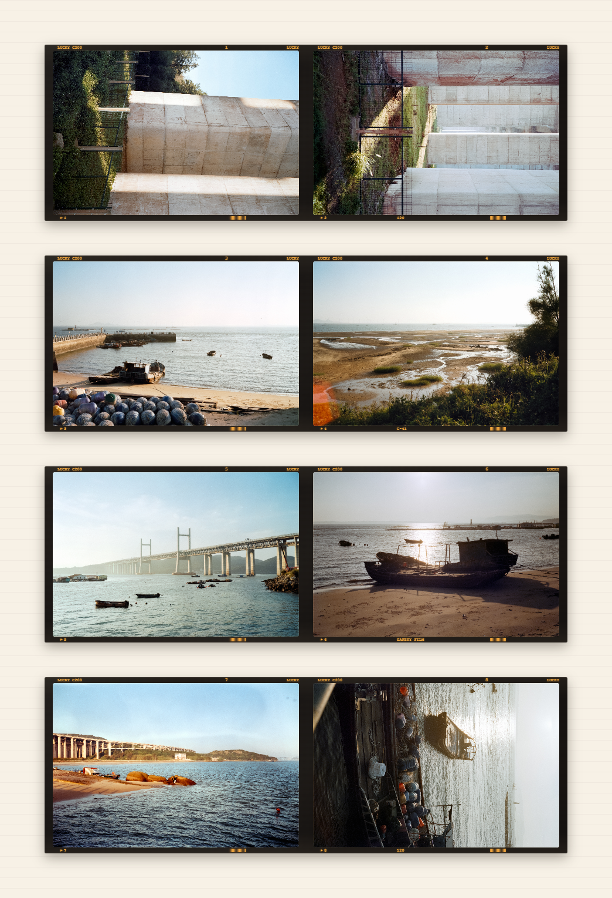
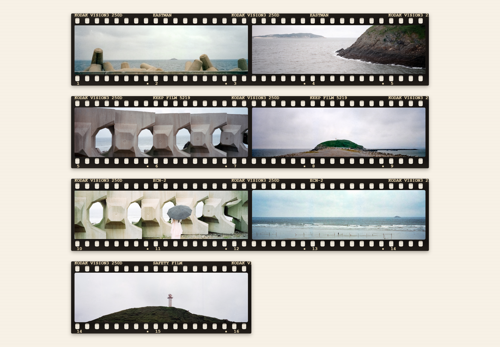
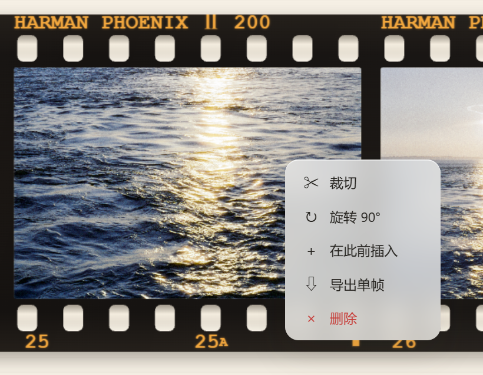
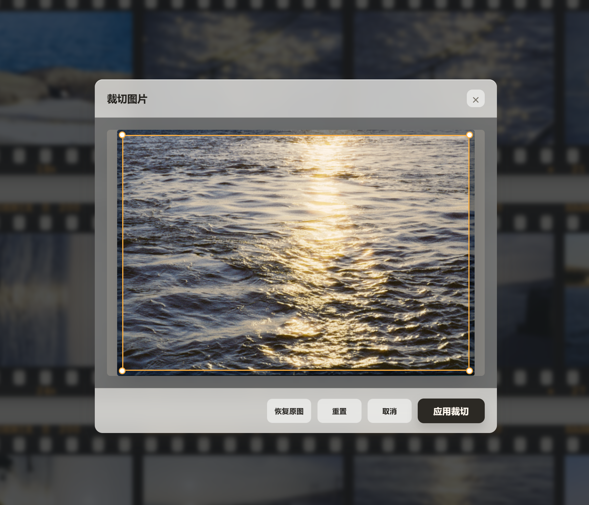

# 海带索引图 FILM

一个纯前端胶片索引图（contact sheet）生成器。把扫描后的单张底片图片整理为 135、半格、120 中画幅的索引图。图片只在浏览器本地处理，不上传服务器。

> 本项目基于 [Judian99/film-index-generator](https://github.com/Judian99/film-index-generator) 二次开发，v1.2.0 新增「A4 竖向（真实底片尺寸）」分页排版、合并/分页导出与 PDF 导出能力。

<p align="center">      
        
</p>

## 索引图示例

<table>      
  <tr>      
    <th align="center">135 底片</th>      
    <th align="center">6×6 中画幅</th>      
    <th align="center">6×9 中画幅</th>      
  </tr>      
  <tr>      
    <td align="center" width="33%"></td>      
    <td align="center" width="33%"></td>      
    <td align="center" width="33%"></td>      
  </tr>      
  <tr>      
    <th align="center" colspan="3">XPan 135 宽幅（65×24mm）</th>      
  </tr>      
  <tr>      
    <td align="center" colspan="3"></td>      
  </tr>      
</table>

## 快速开始

### 1. 在线使用

访问：<https://ohsobrkn.github.io/film-index-generator/>

### 2. 下载 Release 压缩包

本项目是纯前端静态网页，无需安装依赖或运行构建命令。

1. 前往 [Releases 页面](https://github.com/ohsobrkn/film-index-generator/releases)，下载最新版本的 ZIP 压缩包。
2. 将压缩包完整解压到本地文件夹。
3. 进入解压后的目录，用浏览器打开 `index.html`。

### 3. 使用 Git Clone

如需获取最新源码或参与开发，可以克隆仓库：

```bash
git clone https://github.com/ohsobrkn/film-index-generator.git
cd film-index-generator
```

然后用浏览器打开 `index.html`。

### 使用方法

1. **导入照片**：点击“选择或拖入扫描件”，或直接把 JPG/PNG/WebP 文件拖入窗口；也支持从百度网盘导入，首次检视当前帧时按需获取原图。
2. **自动生成索引图**：图片加载完成后即时生成预览，无需手动操作。
3. **调整排版与外观**（侧栏）：
   - **排版**：画幅、每行张数、尺寸基准
   - **胶片外观**：胶卷型号、边字、齿孔、片基等；片头方向默认在左，选择「片头在右」后片头镜像至首行右侧、照片序号自右向左排列、片尾移至末行左侧，末行照片不足整行时右对齐顶格
   - **背景**：淡黄纸底、纯白或高斯模糊
4. **检片**：点击“观片台”或按 `F` 进入沉浸模式；鼠标即观片器，放大整张索引（图片、齿孔、边字、片基与空白），滚轮无极调节倍率（1X–60X）；单击切换聚焦/非聚焦，`Esc` 退出，触控设备可点按切换。图片区直接读取裁切、旋转后的最终原分辨率画面，而非放大预览图。
5. **编辑单帧**：在预览图某一帧上右键打开菜单，可裁切、旋转、插入空白帧、导出单帧、删除（详见下方「编辑单帧」）。
6. **导出索引图**：点击“导出索引图”，在弹窗中选择：
   - **页面比例**：保持当前比例 / A4 竖向 / A4 横向 / 「单张A4（自适应整页）」/ 「**A4 竖向（真实底片尺寸）**」；A4 模式自动优化每行张数并居中扩展画布，不裁切照片
   - **单张A4**：连同信息区块一起自适应，自动匹配页面方向、每行张数、照片尺寸与行距，完整排满单张 A4 互不遮挡；可勾选「以 A4 横向输出」，未勾选默认竖向
   - **A4 竖向（真实底片尺寸）**：按 300dpi 锁定 A4 页面，135 标准帧以 **36 × 24 mm 原大**排印，打印与真实底片 1:1；列数按页面内容宽自动最大化（全画幅每页 5 列）、行不跨页自动分页，侧栏「尺寸基准」「每行张数」自动锁定；预览逐页同步显示（几页就显示几页），弹窗实时显示「A4 × N 页 · 每页 X 列 · 单帧 36 × 24 mm」摘要；仅支持 135 家族画幅，120 画幅选择时自动回退并提示
   - **导出方式（PNG/JPG）**：「合并成一张」（全部页面纵向堆叠为无缝长图，页间不留缝隙）或「分页导出」（每页单独一个文件，文件名含 `page1of2` 等页码）；预览随所选方式同步更新
   - **导出 PDF**：确认导出左侧的「导出 PDF」按钮，可选 150 / 300 / 600 DPI，逐页封装为标准 PDF（页面 210 × 297 mm），直接送印
7. **索引信息区块**（导出弹窗中开启「顶部显示索引信息区块」）：在索引图上方生成 FILM / DATE / CAMERA·LENS / REMARKS 手写字段行：
   - **主题模板**：磨砂玻璃（默认，模糊透出背后画面 + 高光描边与颗粒）、经典胶片、简洁框线、极简线条、暗房夜色
   - **底色**：半透明跟随背景 / 不透明纸底 / 纯白 / 深色 / 内置做旧牛皮纸与羊皮纸纹理 / 透明，纹理底同样支持不透明度与模糊调节
   - **滑块悬浮预览**：不透明度、模糊、框圆角三个滑块带实时数值，点按或拖动任一滑块时弹窗外壳渐隐、滑块以毛玻璃卡片原地悬浮于预览之上，点空白 / `Esc` / 「完成」退出
   - **暗盒图**：可导入透明底暗盒 PNG 放在区块左侧或右侧，自动等比缩放；单击预览中的暗盒弹出操作菜单，可调整尺寸（50%–300%，滑块带「与框线精确等宽」磁吸提醒）、更换图片、恢复默认
   - **其他**：边缘羽化开关（信息栏四周柔和渐隐）；框圆角滑块（外框与字段框内外同值）；字段宽度占比可微调（本地记忆）；内置 FOT-MatissePro 六档字重按需加载；120 画幅下区块高度、间距与字号按画布宽度等比收敛，文字不溢出框线

## 支持格式

| 画幅        | 比例                       | 每行张数     | 方向 | 说明                        |
| --------- | ------------------------ | -------- | -- | ------------------------- |
| 135 全画幅   | 36×24mm                  | 可选择 2–8  | 横图 | 默认选项，带齿孔和边字               |
| 135 宽幅    | XPan 65×24mm / 约 84×24mm | 自动 3 / 2 | 横图 | 通过宽幅规格选择，共享 135 宽幅渲染规则    |
| 半格（单张裁切）  | 18×24mm                  | 固定 12    | 竖图 | 每个文件作为一个竖向半格，片头首行 10 张    |
| 半格（单张未裁切） | 3:2                      | 可选择 4–8  | 横图 | 双格扫描文件作为一张完整图片            |
| 6×6       | 56×56mm                  | 固定 3     | 不限 | 120 中画幅，窄边带、无齿孔           |
| 6×4.5     | 41.5×56mm                | 固定 4     | 竖槽 | 照片自动旋转 90° 进槽             |
| 6×7       | 69.5×56mm                | 固定 2     | 不限 | 120 中画幅                   |
| 6×9       | 84×56mm                  | 固定 2     | 不限 | 120 中画幅，与 135 宽幅 84×24 不同 |
| 6×12      | 112×56mm                 | 固定 3     | 不限 | 120 宽幅中画幅                 |
| 6×17      | 168×56mm                 | 固定 2     | 不限 | 120 宽幅中画幅                 |

## 编辑单帧

在预览图的某一帧上右键，打开帧操作菜单。

<p align="center">      
        
</p>

### 裁切

打开裁切弹窗，拖动四个角调整裁切区域，点击"应用裁切"确认。

<p align="center">      
        
</p>

### 旋转

每点击一次将帧顺时针旋转 90°，支持多次旋转。

### 插入

在当前位置前插入一张空白帧，用于占位或标记。

### 导出单帧

在帧操作菜单中选择“导出单帧”，可将当前画面导出为独立的片基单帧图片。输出会沿用当前图片的裁切、旋转和方向处理，并使用当前索引的画幅、胶卷型号、边字、齿孔、宽幅成像覆盖设置以及排序后的帧号。

正式版仅提供片基单帧效果，不包含拍立得或幻灯片片夹样式。弹窗支持 PNG、JPG，以及 1x、2x、3x 和原图级输出；原图级仅支持 PNG。若原图级单帧超过浏览器画布上限，页面会提示改用 3x。

### 删除

从索引图中移除该帧。

## 胶卷型号

### 内置型号(缓慢更新)

提供常见胶卷型号下拉选择，每种型号包含名称、边字字样、冲洗工艺等预设信息。

### 自定义型号

在"自定义型号"面板中可新增、编辑、删除胶卷型号：

- **名称**：显示名称
- **边字字样**：出现在索引图边字区域，留空表示底片无边字
- **冲洗工艺**：C-41 彩色负片、黑白负片、E-6 反转片、ECN-2 电影卷
- **高级外观**：可自定义边字颜色、交替字样、帧号格式

自定义型号保存在浏览器 localStorage 中，支持 JSON 导入导出。

## 隐私说明

- 图片只在浏览器本地读取和绘制，不上传服务器
- 不写入额外元数据
- 自定义型号数据保存在浏览器 localStorage 中，清除浏览器数据会丢失

## 致谢

本项目基于 **Judian99** 的原创作品二次开发，感谢原作者开源如此实用的胶片工具。

- 原作者仓库主页：<https://github.com/Judian99/film-index-generator>
- 原版在线地址：<https://judian99.github.io/film-index-generator/>

如本项目对你有帮助，也请前往原作者仓库点亮 Star 支持原创。
